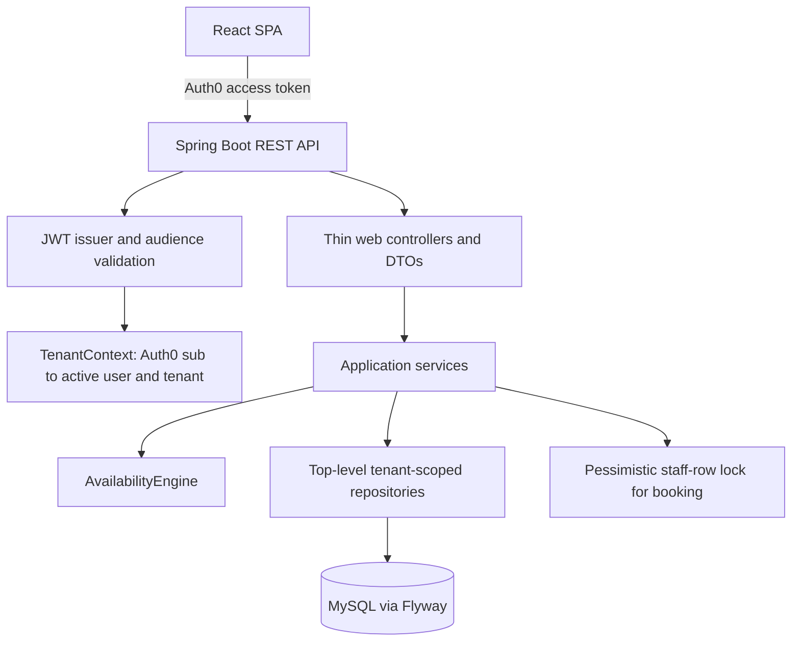

# Backend architecture

The backend uses a pragmatic package-by-feature structure with a small shared layer:

- `service.ServiceCatalogService` owns service offering CRUD.
- `service.StaffFeatureService` owns staff CRUD, service assignments, and availability windows.
- `service.BookingFeatureService` owns availability lookup and booking lifecycle.
- `web.controller` contains thin HTTP adapters. Controllers accept request DTOs and return response DTOs, never JPA entities.
- `web.dto` contains the public request and response records. `web.mapper.ApiMapper` makes entity-to-response conversion explicit.
- `security.TenantContext` resolves the active Auth0 subject to an active tenant membership and enforces tenant-admin operations.
- `common.exception` centralizes API error mapping and shared conflict/not-found types.
- `repo` contains tenant-scoped repository methods. The staff lookup used by booking keeps its `PESSIMISTIC_WRITE` lock.
- Calendar slot generation stays in `service.BookingFeatureService` and delegates each candidate to `AvailabilityEngine`; controllers only map the result to response DTOs.

## Invariants preserved

Tenant IDs come only from the authenticated membership; request payloads cannot select a tenant. Availability is evaluated in the tenant timezone, requires active assigned staff and services, honors working/break windows, rejects cross-day slots, and excludes overlapping confirmed bookings. Booking creation locks the tenant-scoped staff row before checking and saving the slot. `GET /api/services/{serviceId}/staff` returns persisted, tenant-scoped assignments so the UI never guesses assignments from availability.

Entities remain persistence models only. Flyway migrations and the database schema are unchanged.
