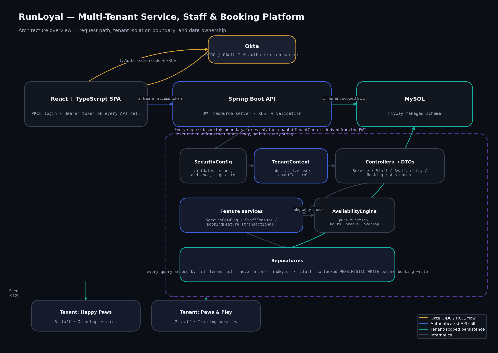
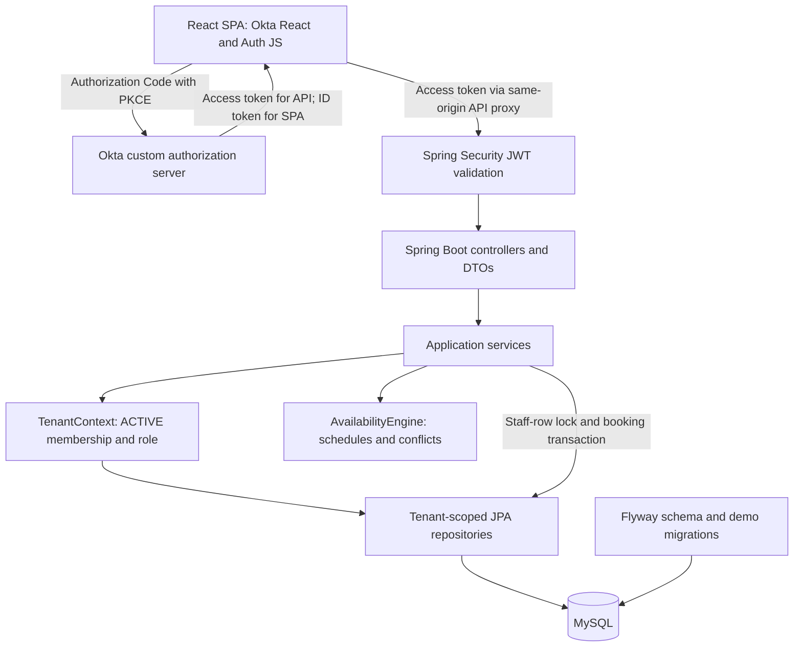

# Backend architecture

## Responsibilities

- **React/TypeScript portal:** routes, service/staff forms, calendars, booking workflows, and TanStack Query caching. Requests go through the Vite development proxy or a production same-origin reverse proxy.
- **Authentication:** the public SPA uses Authorization Code + PKCE without a client secret. Spring Security validates JWT signature, custom issuer, API audience, expiration, subject, and access-token scopes; ID tokens are not API credentials.
- **Controllers/DTOs:** thin HTTP adapters with validated requests and explicit response mapping through `ApiMapper`, not exposed JPA entities. Springdoc generates OpenAPI; exception handling returns structured errors.
- **Application services:** `ServiceCatalogService` owns service CRUD; `StaffFeatureService` owns staff, assignments, and recurring schedules; `BookingFeatureService` owns eligible-slot lookup and booking creation/cancellation.
- **Membership:** `TenantContext` maps the exact verified access-token `sub` to an ACTIVE `users` row. Database membership, not browser IDs or group claims, supplies tenant and role.
- **Availability:** `AvailabilityEngine` evaluates active service/staff, assignments, complete duration, working windows, breaks/OFF, and booking conflicts in the tenant timezone.
- **Persistence:** tenant-scoped JPA repositories store tenants, users, services, staff, assignments, availability, and bookings. Flyway owns schema/demo migrations. Booking writes acquire a pessimistic staff-row lock inside a transaction.

## Boundaries and trade-offs

Bookings and portal time labels are UTC; recurring schedules use tenant IANA zones. `TENANT_ADMIN` can mutate data; STAFF has tenant-scoped reads. Tokens are validated locally, so provider logout/revocation does not guarantee immediate rejection of an already-issued JWT.

The staff-row lock expresses the intended per-staff serialization strategy, but real MySQL concurrent-booking proof and transaction-snapshot analysis remain necessary. The calendar's schedule overlay is not yet an authoritative eligible-slot view. See [TECHNICAL_NOTES.md](TECHNICAL_NOTES.md) for these limitations and [README.md](../README.md) for configuration, API documentation, and demo setup.
